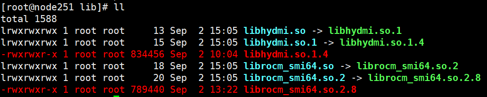

# DCU DCGM
[](https://app.fossa.com/projects/git%2Bgithub.com%2FProject-HAMi%2Fdcu-dcgm?ref=badge_shield)


## 组件信息

DCU DCGM 为 DCU 管理提供 Golang 绑定接口，是管理和监控DCU的工具。包括健康状态监控、功率、时钟频率调控，以及资源使用情况统计等。

## 组件使用前置条件
前置条件：DCGM运行依赖于DCU底层动态链接库libhydmi.so和librocm_smi64.so，这两个动态链接库的安装方式如下。
#### 安装方式一：
1. DCU驱动安装（libhydmi.so动态链接库包含在DCU驱动中）
2. DTK安装并运行source dtk_dir/env.sh使环境变量生效(librocm_smi64.so动态链接库包含在DTK中)

#### 安装方式二：
1. 将pkg/dcgm/lib目录下librocm_smi64.so.2.8和libhydmi.so.1.4动态链接库放置到物理机某个目录下（如/your/path/dcgm/lib）。
   在/your/path/dcgm/lib目录创建指向librocm_smi64.so.2.8的软链接librocm_smi64.so.2和指向librocm_smi64.so.2的软链接librocm_smi64.so；
   在/your/path/dcgm/lib目录创建指向libhydmi.so.1.4的软链接libhydmi.so.1和指向libhydmi.so.1的软链接libhydmi.so。
   
2. 动态链接库加载到系统环境变量
   export LD_LIBRARY_PATH=$LD_LIBRARY_PATH:/your/path/dcgm/lib

## 使用流程

*目前代码仅在内部gitlab中存放，其他项目调用流程如下：*

1. git clone本项目代码到本地，与调用者项目存放于同级目录中；

2. 调用者项目修改go.mod文件：

```
replace g.sugon.com/das/dcgm-dcu => /your/path/dcgm-dcu
```

3. 在本地项目中执行：

```
go mod tidy
```

4. 在golang文件中import相关依赖包之后使用即可，其中api.go为封装DCGM的API调用，提供与DCGM库交互的各种API接口，处理具体的功能调用。/pkg/samoles下是简单的test：

```go
import (
...
"g.sugon.com/das/dcgm-dcu/pkg/dcgm"
...)


func main(){
...
	dcgm.Init()
    defer dcgm.ShutDown()
...

}
```

“# dcu-dcgm”


## License
[](https://app.fossa.com/projects/git%2Bgithub.com%2FProject-HAMi%2Fdcu-dcgm?ref=badge_large)